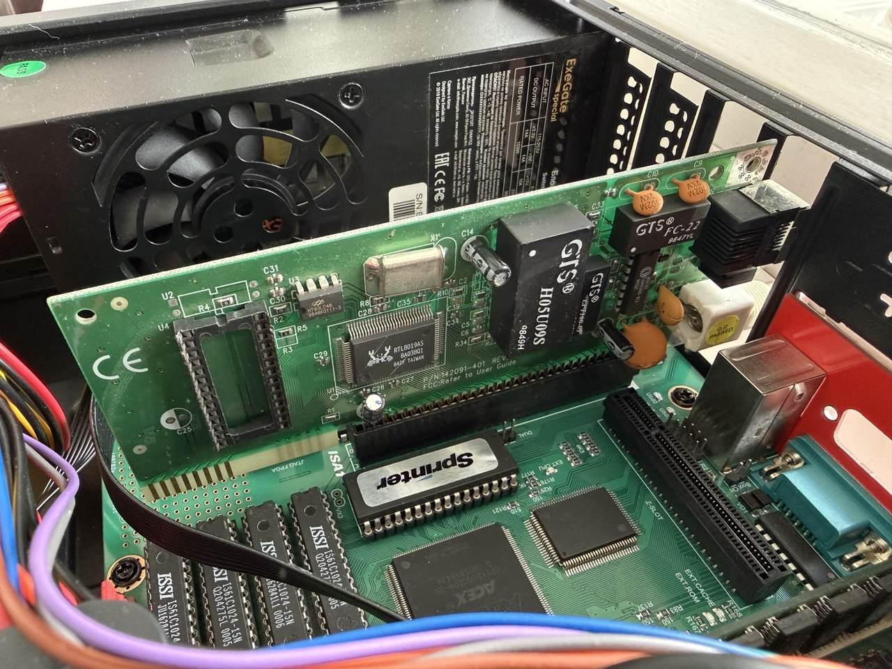
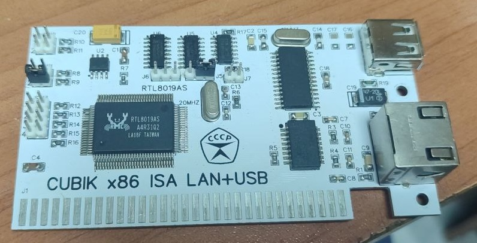
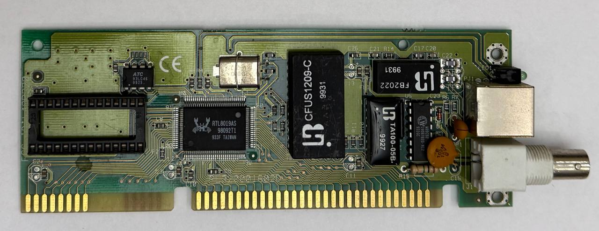
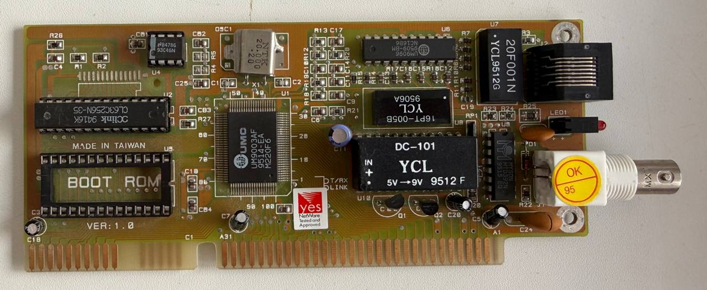

# Sprinter RTL8019AS Network Kit

Network stack and minimal utility set for Sprinter DSS targeting the ISA-8
Ethernet card based on Realtek RTL8019AS / DP8390. Also a development kit
for reusing the driver and stack in other Sprinter DSS programs.

The full staged development plan, register map and acceptance criteria
live in `sprinter_rtl8019_soft.md` (project specification). Repository
guidelines and conventions are in `AGENTS.md` / `CLAUDE.md`. Developer
notes for MAME network setup are in `docs/MAME_NETWORK.md`.

## Attribution

Sprinter RTL8019AS Network Kit project author:

- Dmitry Mikhalchenkov, FidoNet: 2:5030/1997.10

The driver, stack, utilities and DLL in this repository are original
work.  The only imported component is the Z80 interpreter used by the
host-side test harness, which never ships to end users; see
`THIRD_PARTY.md`.

## Status

The release archive contains the supported end-user utilities:

- Setup and diagnostics: `NETCFG`, `IFUP` (static + DHCP),
  `NICINFO`, `ISAPROBE`, `NICEEP`.
- Network clients: `PING` (with `-t/-n/-l/-i/-w` Windows-style
  flags), `NSLOOKUP`, `NTP` (sets the DSS clock), `TFTP`
  (GET/PUT with RFC 2348 blksize), `WGET` (HTTP/1.0 with redirects
  and `-r` resume), `FTP` (passive mode; download, upload, `LIST`
  and `NLST`), `TELNET` (ANSI/VT100 with Zmodem, Ymodem and
  Ymodem-G).

The staged NIC bring-up diagnostics (`HELLO`, `NICRAM`, `NICLB`,
`NICTX`, `NICRX`, `NICMODE`, `ARP`, `UDPTEST`, the `DL*` throughput
probes and `UNETTEST`) are built and copied to the floppy image but
stay out of the release archive; see `tools/artifacts.sh`.

`UNETRTL.DLL` is a loadable library (libman 1.3 / L1) that exposes the
stack to other DSS programs through the same numbered API the
Sprinter Wi-Fi kit implements, so one consumer binary can drive
either card.  It covers TCP (connect, listen, blocking and
non-blocking send), UDP, DNS resolution and ping across two
independent channels.  The ready-built DLL is committed at the
repository root and ships in both release formats; its L1 header
includes the full human-readable package tag. See `docs/UNETRTL.md`
and `docs/UNET_API_RU.md`.

A host-side test harness runs the real built `.EXE` files under a
Z80 / DSS / ISA / RTL8019AS model, with no emulator boot, via
`make test-host`.  It is a mandatory step of every code change; see
`docs/HARNESS.md`.

## Supported cards

The driver is a plain NE2000 / DP8390 implementation, so it is not tied
to the Realtek part it was developed against.  These four ISA-8 cards
are verified end to end on a real Sprinter:

| Card                        | Controller | Media     | `NET.CFG` |
|-----------------------------|------------|-----------|-----------|
| P/N 142091-401              | RTL8019AS  | RJ45, BNC | none      |
| CUBIK x86 ISA LAN+USB       | RTL8019AS  | RJ45      | none      |
| RTL8019AS combo, green PCB  | RTL8019AS  | RJ45, BNC | none      |
| UMC UM9003AF ver 1.0        | UM9003AF   | RJ45, BNC | `RTL_HW`  |

Realtek P/N 142091-401, in the slot it was developed on:



CUBIK x86 ISA LAN+USB, a current-production board (the USB half is
unrelated to this kit and needs its own driver):



RTL8019AS combo card, green PCB:



UMC UM9003AF ver 1.0:



### Cards without the Realtek ID

The I/O base auto-scan walks both ISA slots and all sixteen jumperless
bases from `0x200` to `0x3E0`, but it demands the Realtek 8019 ID `Pp`
on page 0 before it claims a base, because a floating or mirrored ISA
window can otherwise pass the register probe.  The UM9003AF answers
`20 01`, so it must be pinned:

```
RTL_HW=0/#300
```

The digits are the ISA slot (`0` or `1`) and the hex I/O base.  A pinned
base skips the signature check and accepts any responding NE2000 core,
so the same applies to any other clone.

`RTL_RESET` is not needed.  The driver reads the chip ID and pulses the
NE2000 board reset port at `BASE+0x1F` only for a genuine Realtek; that
port stalls the ISA bus cycle on this card and would freeze the machine.
`docs/HOWTO.md` covers the explicit overrides, and `docs/ISAPROBE.md`
what to do when a card is not found at all.

**Never select page 3 on a chip that did not answer the Realtek ID
probe, least of all next to a transmit.** Page 3 is a Realtek
extension; a UM9003 mirrors page 1 there instead of exposing PHY
config registers, so reading it returns MAC bytes, not a medium/duplex
state (see `docs/PING.md`). Worse, on a UMC UM9003F the pre-v0.3.19
driver selected page 3 immediately before the TXP write and again
after PTX as part of `CAPTURE_TX_PHY_PRE`/`_POST`, and that stray page
switch cost 17-27% of transmitted frames outright -- the chip reported
`PTX`/`TSR=03`, but a capture on the target never saw the frame at
all. Confirmed by an A/B on the same card, cable and evening: the old
`PING.EXE` kept losing, v0.3.19 (page-3 capture gated on `RTL_CHIP_KIND
= RTL_CHIP_REALTEK`, see `IS_REALTEK`/`CAPTURE_TX_PHY_PRE` in
`src/lib/rtl8019.asm`) sent 20/20, and v0.3.20 sent 50/50.

## Installing on Sprinter DSS

The `distr/sprinter-rtl8019a.zip` archive and the FAT12 floppy image both
ship 8.3 names so they can be unpacked / copied directly onto the target
FAT16 hard disk. After unpacking, configure networking by renaming the
sample config:

```
REN NETSMPL.CFG NET.CFG
```

Then edit `NET.CFG` for your local network.  The keys are `RTL_HW`
(ISA slot and I/O base as `S/#HHH`), `RTL_IRQ`, `RTL_RESET`, `RTL_MAC`,
`IP` (a literal address or the keyword `DHCP`), `NETMASK`, `GATEWAY`,
`DNS1`, `DNS2`, `TZ` and `NTP`.  The template documents each one
inline; every key is optional except `IP`.

Run `NETCFG -i`, then `IFUP`, and use `PING` to verify connectivity.
For hardware troubleshooting, `NICINFO`, `ISAPROBE` and `NICEEP` are
included in the archive; detailed probe procedures are in `ISAPROBE.TXT`.
`NICEEP` dumps the 93C46 configuration EEPROM of a jumperless card
(read-only) so its I/O base, IRQ and media settings can be inspected
without a DOS machine and the vendor's setup utility.

## Build

Requires `sjasmplus` in `PATH`. `make package` additionally needs `zip`;
`make image` additionally needs `mtools` (`mformat`, `mcopy`);
`make test-host` needs `node`.

```
make build      # assemble src/apps/*.asm into build/*.EXE
make test-host  # run the host-side EXE harness suites
make package    # produce distr/sprinter-rtl8019a.zip
make image      # produce distr/sprinter-rtl8019a.img (FAT12 floppy)
make clean      # remove build/ and the two distr artifacts
```

The normal development cycle is `make test-host package image`, because
the MAME test stand boots from the floppy image and a fresh `.EXE` in
`build/` is invisible until the image is rebuilt.

Direct sjasmplus invocation for a single source:

```
sjasmplus -I src/include -I src/lib --raw=build/PING.EXE src/apps/ping.asm
```

## Running in MAME

```
/Users/dmitry/dev/zx/sprinter/mame/mame sprinter -isa1 rtl8019as
```

For low-level driver / network-provider details (PROM layout,
reset sequence, RX ring header, pcap vs slirp on macOS) see
`docs/MAME_NETWORK.md`.  The section below covers the
**operational** test stand -- which host services to start
before each utility, and how to optionally share real
internet access into the emulator.

## Test stand setup

The kit's network utilities are tested against host-side
helpers that live next to MAME:

| Sprinter utility       | Host service / role                               |
|------------------------|---------------------------------------------------|
| `PING`                 | none (kernel of the host replies natively)        |
| `IFUP` (DHCP mode)     | `dnsmasq` -- DHCP server                          |
| `NSLOOKUP`             | `dnsmasq` -- DNS forwarder (or local A records)   |
| `TFTP`                 | any TFTP server (`tftpd-hpa`, `dnsmasq --enable-tftp`) |
| `NTP`                  | `tools/dev/ntp_serve.py` -- minimal NTP responder |
| `WGET`                 | `python3 -m http.server` -- static HTTP/1.0       |
| `FTP`                  | `pyftpdlib` -- minimal FTP server (anonymous)     |
| `TELNET`               | Telnet/BBS service or a raw TCP terminal server   |

The same virtual interface (a host-only NIC at
`192.168.7.1/24`) carries every test.  Sprinter sees this
interface on the wire and either gets its IP via DHCP
(`IP=DHCP` in `NET.CFG`) or uses a static address
(typically `192.168.7.5`).  All host-side services bind to
`192.168.7.1` so the Sprinter side reaches them at that
address.

### macOS

macOS ships a BSD-style "fake Ethernet pair" (`feth0`,
`feth1`).  One end is plugged into MAME (`pcap`
backend), the other gets the host IP.  Setup once per boot:

```sh
sudo ifconfig feth0 create
sudo ifconfig feth1 create
sudo ifconfig feth0 peer feth1
sudo ifconfig feth0 up
sudo ifconfig feth1 inet 192.168.7.1/24 up
```

Verify:

```sh
ifconfig feth0
ifconfig feth1
```

Launch MAME pointing at `feth0` (the wire-side end).  The
launcher script
`/Users/dmitry/dev/zx/sprinter/mame/run_sprinter_rtl8019as.sh`
only prints the requested NIC name; the actual pcap interface
is selected once via MAME's own UI (Tab -> Network Devices)
and persisted in `cfg/sprinter.cfg`.

The script's built-in disks (`sp_hdd_sys.chd`/`sp_hdd_media.chd`)
are a shared, persistent Sprinter DSS desktop used across
projects -- it does NOT include this repo's build.  Attach the
freshly built floppy image explicitly, appended after the
script's own arguments (a later `-flop2` overrides the script's
built-in one, which otherwise holds an unrelated utility disk on
the same 3.5" HD drive):

```sh
run_sprinter_rtl8019as.sh -networkprovider pcap \
  -flop2 /Users/dmitry/dev/zx/sprinter/sprinter-rtl8019a/distr/sprinter-rtl8019a.img
```

DSS then sees the build on drive `B:` -- work from there directly
(it already carries every utility and `NETSMPL.CFG`).  See
`docs/MAME_NETWORK.md` for the full setup.

`/dev/bpf*` permissions are required for `pcap` to work.
First run typically needs:

```sh
sudo chmod o+r /dev/bpf*
```

(Resets after reboot; consider `chmod-bpf` from Wireshark
or a launchd plist for permanent access.)

Host services on macOS:

```sh
# DHCP + DNS forwarder (anonymous A records work too)
sudo dnsmasq -k --listen-address=192.168.7.1 --bind-interfaces \
  --dhcp-range=192.168.7.100,192.168.7.150,12h \
  --dhcp-option=3,192.168.7.1 --dhcp-option=6,192.168.7.1 \
  --server=1.1.1.1 --server=8.8.8.8 --no-resolv \
  --address=/sprinter.local/192.168.7.1

# HTTP for WGET (run from the directory you want to serve)
cd /tmp/web-test && sudo python3 -m http.server 80 --bind 192.168.7.1

# NTP responder
sudo python3 tools/dev/ntp_serve.py --bind 192.168.7.1

# FTP (pyftpdlib) -- install once via venv:
python3 -m venv ~/ftpd-venv
~/ftpd-venv/bin/pip install pyftpdlib
sudo ~/ftpd-venv/bin/python -m pyftpdlib -p 21 -i 192.168.7.1 \
  -d /tmp/web-test -w
```

### Linux

Linux uses `veth` for a host-only pair.  One end stays in
the host namespace (it's the "host side"), the other is
left up but unconfigured -- MAME's `pcap` backend grabs
frames there.

```sh
sudo ip link add veth0 type veth peer name veth1
sudo ip addr add 192.168.7.1/24 dev veth1
sudo ip link set veth0 up
sudo ip link set veth1 up
```

Launch MAME with `-netdev pcap,name=veth0`.  Same `pcap`
permissions caveat -- on Linux you may need to grant
`CAP_NET_RAW` to the MAME binary or run as root once.

Host services are exactly the same as macOS.  `dnsmasq`,
`python3 -m http.server`, `pyftpdlib` etc. are all stock
packages (`apt install dnsmasq python3-pip` etc.).

### Windows

On Windows the simplest stack is **WSL2** running a Linux
distribution: keep MAME on the Windows side, run all host
services inside WSL2 using the Linux instructions above.
WSL2 brings its own virtual switch, so a `veth` pair plus
the standard services work as on bare Linux.

Native Windows-only setup is also possible but heavier:

- Install **Npcap** (libpcap port) so MAME's `pcap`
  backend can attach to a Windows interface.  Choose
  "Install Npcap in WinPcap API-compatible Mode" on the
  installer.
- Create a virtual NIC.  Easiest is the **Microsoft Loopback
  Adapter** (`hdwwiz.exe` -> "Add legacy hardware" ->
  "Network adapters" -> "Microsoft" -> "Microsoft KM-TEST
  Loopback Adapter").  Give it `192.168.7.1/24` in
  `Control Panel -> Network Connections -> properties`.
- Launch MAME with `-netdev pcap,name="Microsoft KM-TEST..."`.
- Install host services natively or via WSL2.  `dnsmasq` is
  not packaged for Windows; use a small Python equivalent
  or skip DHCP and configure `NET.CFG` statically.

For most testing WSL2 + Linux instructions are recommended.

### Internet access for the virtual interface

By default the host-only pair (`feth0/feth1`, `veth0/veth1`)
is **isolated** -- the Sprinter can talk to the host but
not to the public internet.  That's fine for `PING`, local
TFTP / FTP, dnsmasq-cached DNS, and anything served from
the host directly.  To reach the real internet (e.g. for
WGET against an upstream HTTP server, or NTP from
`pool.ntp.org`) the host has to act as a NAT gateway.

#### macOS

```sh
# Enable IP forwarding.
sudo sysctl -w net.inet.ip.forwarding=1

# NAT outbound traffic that came in on feth1 to the
# physical interface (en0 wifi or en1 ethernet -- adjust).
echo 'nat on en0 from 192.168.7.0/24 to any -> (en0)' | \
    sudo pfctl -ef -
```

This is non-persistent.  The same rule can be put in
`/etc/pf.anchors/sprinter` and loaded at boot via
`/etc/pf.conf`; see `man pfctl`.  System Integrity
Protection sometimes blocks pf in custom configurations,
in which case dropping back to local-only services is the
safer path.

The Sprinter's default route must point at `192.168.7.1`
(set by IFUP/DHCP automatically when dnsmasq advertises
option 3).

#### Linux

```sh
sudo sysctl -w net.ipv4.ip_forward=1

# Replace eth0 with your real outbound interface
# (e.g. wlan0).
sudo iptables -t nat -A POSTROUTING -s 192.168.7.0/24 \
    -o eth0 -j MASQUERADE
sudo iptables -A FORWARD -i veth1 -o eth0 -j ACCEPT
sudo iptables -A FORWARD -i eth0 -o veth1 \
    -m state --state RELATED,ESTABLISHED -j ACCEPT
```

Persistent setup: drop the rules into `iptables-save` /
`netplan` / `systemd-networkd` depending on the distro.

#### Windows

In the Network Connections control panel, right-click the
real adapter (Wi-Fi or Ethernet), open Properties ->
Sharing, tick **Allow other network users to connect
through this computer's Internet connection**, and pick
the loopback adapter as the home network.  This enables
the built-in **Internet Connection Sharing (ICS)** which
implements NAT + a bundled DHCP server.  Note that ICS
sometimes hard-codes `192.168.137.1/24` for the shared
side -- adjust `NET.CFG` and dnsmasq to match, or disable
the ICS DHCP and use your own dnsmasq.

If you're using WSL2 instead, NAT is handled by the WSL2
virtual switch; the Linux instructions inside WSL2 are
sufficient.

### Sanity checklist

After bringing the test stand up, verify in this order:

1. `ifconfig feth1` (or equivalent) shows `192.168.7.1`.
2. From the host: `ping 192.168.7.1` succeeds.
3. From MAME: `PING 192.168.7.1` (after `NETCFG -i; IFUP`)
   succeeds.
4. Host service started, e.g. `python3 -m http.server`
   prints "Serving HTTP on 192.168.7.1 port 80".
5. Sprinter utility runs: `WGET http://192.168.7.1/test.txt`
   prints `Done. NN bytes received.`

If any step fails, the issue is at that layer (interface
configuration / pcap permission / firewall / utility
itself).  Most surprises in practice come from `pcap`
permissions and from `dnsmasq` colliding with the system
resolver -- `--listen-address=192.168.7.1
--bind-interfaces` plus `--no-resolv` defuses that on
macOS.

## Layout

```
src/include/      shared includes (DSS, Sprinter, RTL8019AS constants, macros,
                  UNET ABI mirror)
src/lib/          reusable driver and stack modules
src/dll/          libman 1.3 / L1 loadable libraries (UNETRTL.DLL)
src/apps/         utility entry points
config/           NETSMPL.CFG configuration template
docs/             user docs (shipped) and developer docs (not shipped)
docs/img/         card photos for this README (not shipped)
docs/evidence/    dated hardware / MAME acceptance records
examples/         DSS batch files and host-side helpers
tools/            build / package / image scripts and dev helpers
tools/exe-harness/  host-side Z80 / DSS / RTL8019AS test harness
build/            generated EXE outputs (ignored)
distr/            generated zip and floppy image (ignored)
```
